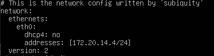
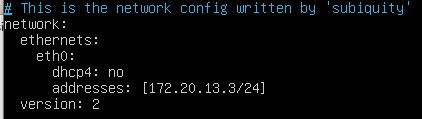
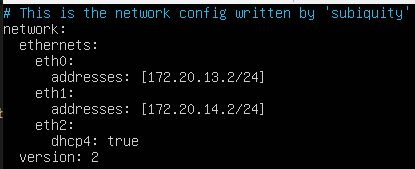

# Práctica PR1101. Configuración de red en Linux

En esta práctica debes indicar el comando que introducirías en Bash para realizar lo que se pide en cada uno de los puntos. Debes introducir la respuesta en el espacio reservado para código después de cada punto.

Para descargar este archivo en formato `md` hazlo desde la url `https://vgonzalez165.github.io/apuntes_iso/UT11_Linux_Instalacion/11_pr1101.md`


## Ejercicio 1. Configuración básica de red

Para ese ejercicio necesitas una máquina virtual con Ubuntu Server y 2 adaptadores de red, el primero en modo puente y el segundo en modo NAT.

Para el adaptador en modo puente utilizarás una IP de la red 172.30.0.0/16 mientras que el adaptador en modo NAT tendrá configurada una IP dinámica.

**Entrega**:
1. Resultado de ejecutar el comando `ip address show`

```


```

2. Captura de los ficheros de configuración de `netplan`

```


```

3. Captura de la salida del comando ping a 2 compañeros (que tienen su adaptador en modo puente en la misma red que tú), así como a una dirección de Internet (p.e. Google.es)

```

```

## Ejercicio 2: Múltiples redes

Vamos a hacer ahora un ejercicio algo más complicado en el que se configuraremos varios equipos en diferentes redes.

Vas a necesitar 4 máquinas virtuales con Ubuntu Server, por lo que el primer paso será realizar tres clonaciones de la máquina que instalamos el primer día. Como probablemente estás utilizando Hyper-V no tendrás problema ya que, al clonar una máquina, le asigna una nueva dirección MAC. Si usaras algún otro hipervisor asegúrate de que las máquinas tengas diferentes direcciones MAC.

**1.- Cambiar los nombres de equipos**

Lo primero de todo, vamos a cambiar los nombres de equipo de todos los servidores, que se identificarán por una letra y tus iniciales. En mi caso serían `a-vjgr`, `b-vjgr`, `c-vjgr` y `d-vjgr`.

Para cambiar el nombre de equipo en Ubuntu Server hay que hacerlo con el comando hostnamectl mediante la siguiente orden:

```bash

$ sudo hostnamectl set-hostname nuevo_nombre

```

Tras hacerlo, también hay que modificar el fichero `/etc/hosts`, reemplazando el nombre antiguo por el nuevo. No es necesario reiniciar el equipo para que se apliquen estos cambios.

**2.- Configurar un servidor como router**

La otra cosa que necesitarás para esta práctica es configurar un servidor como enrutador. Para ello hay que realizar dos pasos, habilitar el **forwarding** y configurar **iptables** para que reenvíe todos los paquetes que lleguen por un enlace a otro.

Para habilitar el forwarding simplemente debes editar el fichero `/etc/sysctl.conf` y añadir (o descomentar) la línea `net.ipv4.ip_forward=1`. Luego aplicas los cambios ejecutando el comando `sysctl -p`

La configuración de iptables se sale del ámbito de este módulo, así que simplemente limítate a copiar las siguientes líneas en el Shell de Ubuntu.

```bash
$ sudo iptables -F
$ sudo iptables -t nat -A POSTROUTING --out-interface {interfaz_salida} -j MASQUERADE
$ sudo iptables -A FORWARD --in-interface {interfaz-entrada} -j ACCEPT
```

La estructura de red que queremos representar es la siguiente:


 
Como puedes apreciar, tenemos cuatro servidores, tres con una interfaz de red (que en Hyper  configurarás en modo red interna) y un cuarto servidor que funcionará como enrutador, por lo que tendrá tres interfaces de red: una conectada al *default switch*  para dar salida a Internet y otras dos en modo red interna que se conectarán a las dos subredes que tenemos.

Las IPs de las subredes del ejemplo son orientativas y no son las que tienes que utilizar tú. Tú tienes asignada la red 172.20.X.0/24, donde X es tu número de equipo y tendrás que extraer dos direcciones de subred de dicha red para asignarlas a los equipos.

Entrega: 

1. Debes indicar qué subredes has utilizado, señalando qué IPs has asignado a cada equipo.

```bash
red 1 -> 172.20.14.0/24
a-rfdb -> 172.20.14.3
b-rfdb -> 172.20.14.4
SERVER d-rfdb -> eth1 -> 172.20.14.2

red 2 -> 172.20.13.0/24
c-rfdb -> 172.20.13.3
SERVER d-rfdb -> eth0 -> 172.20.13.2

```

2. Captura de los ficheros de configuración de netplan de los cuatro equipos.

Netplan A


Netplan B



Netplan C



Netplan D




3. Captura desde los 3 equipos de un ping hacia el enrutador, hacia el otro equipo de la red (solo en el caso de la primera red) y hacia una dirección de internet (por ejemplo, la IP 8.8.8.8)

Ping de A to Server


Ping de A to B


Ping B to Server


Ping C to Server


Ping Server to A and Web


## Ejercicio 3: Experimentando con la tabla ARP

Ahora vamos a trabajar con la tabla ARP de los equipos de la red anterior. Realiza las siguientes tareas:

1.- Muestra la tabla ARP del equipo A (el que está en una subred con otro equipo). Explica qué indica cada una de las líneas que se muestran.

```bash
ricardo@a-rfdb:~$ ip neigh show
172.20.14.1 dev eth0 lladdr 00:15:5d:74:01:1a REACHABLE
172.20.14.4 dev eth0 lladdr 00:15:5d:74:01:34 STALE
172.20.14.2 dev eth0 lladdr 00:15:5d:74:01:37 STALE

te muestra:
la IP con la que has hecho ping
el adaptador con el que se hace el ping desde la maquina
la mac del dispositivo donde has hecho ping
el estado de esa mac: 
- si has hecho ping hace poco y la mac no ha cambiado te pone "REACHABLE"
- si has hecho ping hace mucho y no sabe si la mac ha cambiado o no, pone "STALE"
```

2.- Elimina todas las entradas de la tabla ARP del equipo

```bash
ricardo@a-rfdb:~$ sudo ip -s -s neigh flush all
[sudo] password for ricardo:
172.20.14.1 dev eth0 lladdr 00:15:5d:74:01:1a ref 1 used 0/0/0 probes 4 REACHABLE
172.20.14.4 dev eth0 lladdr 00:15:5d:74:01:34 used 1258/1258/1223 probes 4 STALE
172.20.14.2 dev eth0 lladdr 00:15:5d:74:01:37 used 717/717/682 probes 4 STALE

*** Round 1, deleting 3 entries ***
*** Flush is complete after 1 round ***
```

3.- Añade manualmente la entrada ARP con la IP y MAC del equipo que hace de enrutador (equipo D)

```bash
ricardo@a-rfdb:~$ ip neigh add 172.20.14.2 lladdr 00:15:5d:74:01:37 dev eth0 nud PERM
```

4.- Comprueba que lo has hecho bien haciendo un ping al equipo D

```bash
ricardo@a-rfdb:~$ ip neigh show
172.20.14.2 dev eth0 lladdr 00:15:5d:74:01:37 REACHABLE
```

5.- ¿Cuándo crees que se añadirán automáticamente más entradas a la tabla ARP? Justifica tu respuesta

```
Cuando haga ping a un equipo, se añadirá a la tabla ARP,
pero siempre estara en la tabla ARP la IP del pc-origen

```

6.- Elimina cualquier entrada de la tabla ARP que no sea la del enrutador. Haz un ping al otro equipo de la red (equipo B). ¿Qué cambios ha habido en la tabla ARP? ¿Por qué?

```bash
ricardo@a-rfdb:~$ sudo ip -s -s neigh flush all
ricardo@a-rfdb:~$ ip neigh show
172.20.14.1 dev eth0 lladdr 00:15:5d:74:01:1a REACHABLE
172.20.14.4 dev eth0 lladdr 00:15:5d:74:01:34 REACHABLE

Cambios: 
Vuelve a estar la IP del pc-origen y la del pc donde he hecho ping
```

7.- ¿Qué crees que pasaría si introducimos una entrada errónea en la entrada ARP? Por ejemplo, si poner la IP de un equipo y la MAC de otro diferente. Justifica tu respuesta.

```bash
ricardo@a-rfdb:~$ ip neigh add 172.20.14.4 lladdr 00:15:5d:74:01:1a dev eth0
RTNETLINK answers: Operation not permitted

he probado a darle la IP de un pc y la mac del pc-origen y no deja hacer la operacion
```


